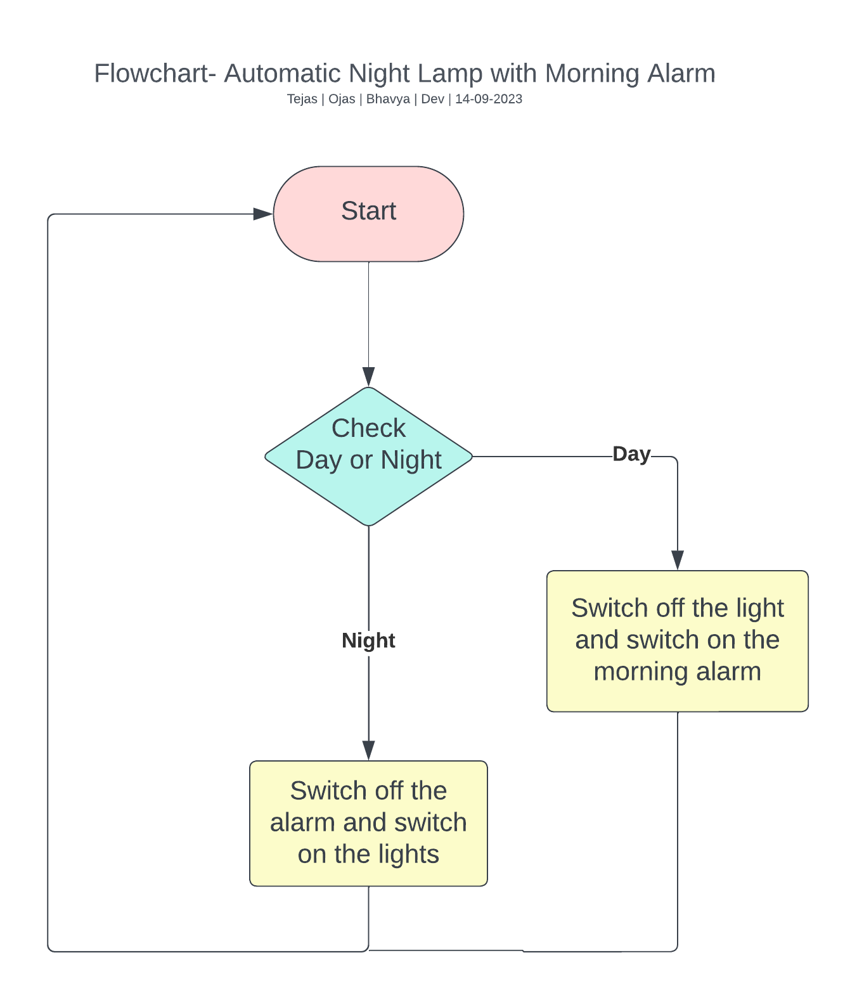
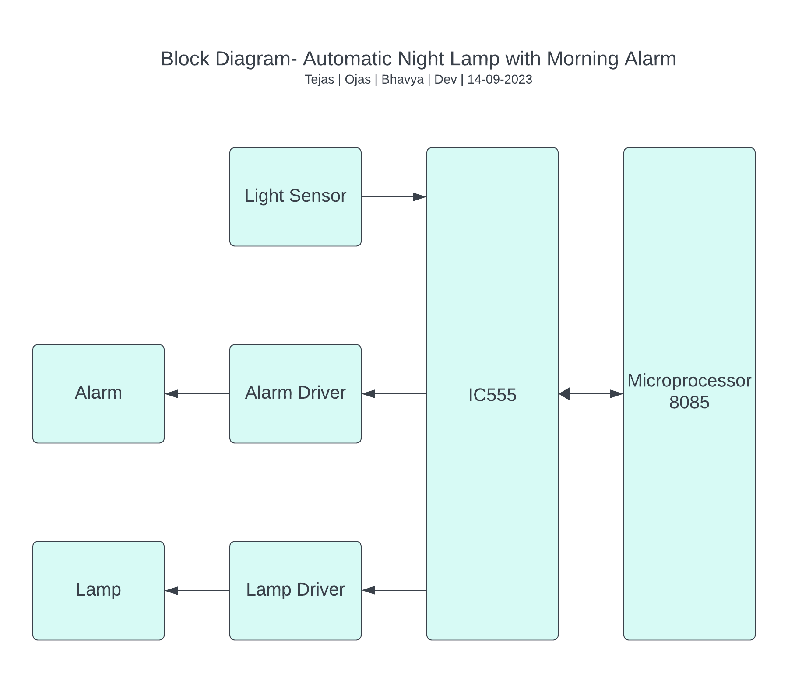

# Automatic Night Lamp & Alarm

## Abstract

In an increasingly interconnected world, the quest for enhancing everyday convenience and energy efficiency has become paramount. This project, "Automatic Night Lamp with Morning Alarm," presents an innovative solution that seamlessly combines automation, lighting control, and wake-up functionality to improve daily living.
The primary objective of this project is to design and implement a versatile device that can intelligently adapt to ambient lighting conditions during nighttime hours and, at the same time, serve as an effective alarm clock to gently awaken users in the morning. The system incorporates a combination of hardware and software components to achieve this dual functionality.
The core of the system utilises light sensors to detect changes in ambient light levels. When the environment becomes dark, the automatic night lamp is triggered to emit a soft and adjustable illumination, preventing users from stumbling in the dark. During the day, the system switches off to conserve energy.
In addition to its nighttime lighting capabilities, the device also functions as a morning alarm. The system is designed with user-friendliness, featuring an intuitive control interface. 
The "Automatic Night Lamp with Morning Alarm" project not only offers convenience and energy savings but also contributes to promoting healthier sleep patterns and overall well-being. This innovation has the potential to improve the quality of life for individuals by enhancing their daily routines while minimising energy consumption.

## Automatic Night Lamp and Morning Alarm System using Microprocessor 8086

### Introduction

With the advent integrated circuits latest and modern microprocessors are available
which works with a very high clock speed. But the 8085A Microprocessor is still the most popular microprocessor and widely used in higher education. It has simple architecture and adequate instruction set and works with a clock speed of 5 MHz. The beauty of this microprocessor is its logical and simple assembly language programming. We will develop a system that will automatically switch ON the lamp at night and give a morning alarm for some time and switch off the night bulb using 8085A microprocessor. The electronic circuit for glowing the night lamp and ringing the alarm at proper time was designed and interfaced with the 8085A microprocessor through a LDR (Light Dependent Resistor). The software for the same was prepared in the assembly language of the Microprocessor 8085. The simple logic of assembly language programming is very easy to understand rather it is self explanatory. 

### Purpose

The purpose of our automatic night lamp and morning alarm project is to enhance the sleep and wake-up experience for users by providing an intelligent and automated system for managing lighting conditions during nighttime and waking up in the morning. The project aims to address several key purposes:

1. Improved Sleep Quality:
   - The automatic night lamp ensures that the ambient lighting in the sleeping environment is suitable for rest, promoting better sleep quality.

2. Natural Wake-up Experience:
   - The morning alarm is designed to simulate a natural wake-up experience, gradually increasing in intensity or using pleasant sounds to wake users up gently.

3. User Convenience:
   - The system offers user-friendly interfaces for setting alarms and manually controlling the night lamp, providing convenience and customization options.

4. Energy Efficiency:
   - Power-saving features and the automatic adjustment of the night lamp based on ambient light levels contribute to energy efficiency.

5. Personalization:
   - Customizable settings, such as alarm tones, night lamp brightness, and color, allow users to tailor the system to their preferences and create a personalized sleep environment.
   - 
In short, the purpose of our automatic night lamp and morning alarm project is to create a holistic sleep and wake-up solution that prioritizes user comfort, health, and convenience while leveraging technology to enhance the overall sleeping experience.

### Components:

1. Microprocessor 8086: The central processing unit, executing instructions and managing the system's logic.

2. Light Sensor: Detects ambient light conditions, influencing the activation of the night lamp.

3. Real-Time Clock (RTC): Maintains accurate timekeeping for scheduling the morning alarm.

4. Relay Module: Facilitates the control of the night lamp based on input from the light sensor.

5. Buzzer: Produces sound for the morning alarm, signalling the user at the specified time.

6. LED Display: Showcases time information retrieved from the RTC.

7. Input Buttons: Enable user interaction for setting the current time and morning alarm time.

8. Peripheral Interface Adapter (PIA): Acts as an interface between the microprocessor and RTC.

### Working Principle:

1. Light Sensing:

   - The light sensor continuously monitors ambient light conditions.
   - When the light level falls below a specified threshold, indicating nighttime, the microprocessor activates the night lamp through the relay module.

2. Real-Time Clock:

   - The RTC maintains accurate timekeeping, ensuring synchronisation with the real-world clock.
   - Users can set the initial time, and the system updates time information regularly.

3. Night Lamp Control:

   - The microprocessor evaluates the light sensor input and controls the relay module accordingly.
   - If the light level is below the threshold, the night lamp is activated; otherwise, it remains off.

4. Morning Alarm:

   - Users can set the morning alarm time using input buttons.
   - When the RTC matches the set alarm time, the microprocessor triggers the buzzer, signalling the start of a new day.

5. User Interface:

   - Input buttons allow users to set the current time and morning alarm time.
   - The LED display provides a visual representation of the current time.

### Software Flow / Algorithm:

Below is a high-level algorithm for the Automatic Night Lamp and Morning Alarm System using Microprocessor 8086. This algorithm provides a step-by-step guide for the main functionalities of the system:

#### Algorithm: Automatic Night Lamp and Morning Alarm System
1. Initialize System:
   1.1 Set up Microprocessor 8086.
   1.2 Configure ports for input and output devices.
   1.3 Initialize Real-Time Clock (RTC) with the current time.
   1.4 Set the initial state of the night lamp and buzzer.

2. Main Loop:
   2.1 Continuously monitor the light sensor.
   2.2 Read the analog input from the light sensor.
   2.3 Compare the light level with a predefined threshold.
  2.4 If light level is below the threshold, turn on the night lamp using the relay module.
   2.5 If light level is above the threshold, turn off the night lamp.

3. Real-Time Clock (RTC) Handling:
   3.1 Read the current time from the RTC.
   3.2 Update the LED display to show the current time.

4. Morning Alarm Check:
   4.1 Read the set morning alarm time from user input.
   4.2 Compare the current time from the RTC with the set alarm time.
   4.3 If the alarm time is reached, activate the buzzer using the buzzer port.

5. User Interface:
   5.1 Check for user input using input buttons.
   5.2 Allow users to set the current time and morning alarm time.
   5.3 Update the RTC and alarm settings based on user input.

6. End Algorithm

### Flowchart
This flowchart provides a basic structure for our project.

#### Explanation:
• Initialization: Set up the initial parameters, including the current time, date, and the desired alarm time.

• Nighttime Check: Determine whether it is nighttime based on the current time. 

•  Lamp Check: If it is nighttime, activate the night lamp; otherwise, deactivate it.

• Alarm Check: Check if the current time matches the set alarm time. If it does, activate the morning alarm.

• End: Check if the project is finished or turned off. If it is, end the flowchart; otherwise, continue.

### Block Diagram
This block diagram provides a medium-level overview of the major components and their connections in your automatic night lamp and morning alarm project. 

#### Explanation:
• Microprocessor (8085/8086): The central processing unit that controls and coordinates the entire system.

• Night Lamp and Morning Alarm: Output devices that are controlled by the microprocessor. The night lamp is activated during nighttime, and the morning alarm is activated at the set time.

• Light Sensor: Monitors ambient light levels to determine whether it is nighttime or daytime.

• Buzzer/Speaker: Produces sound for the morning alarm.

• Real-time Clock: Keeps track of the current time and date.

• Display (LED, LCD): Displays the current time, alarm time, and other relevant information.

### Code Snippets (Assembly Language for 8086):
Below is a simplified example in assembly language. This example assumes the use of an 8086 microprocessor. 

```assembly
; Sample code for alarm triggering based on RTC input
CheckAlarm:
MOV AX, 0402; Function to read RTC time
MOV CX, 00; Address of hours in RTC
INT 1AH ; Call interrupt for RTC input
CMP AL, [AlarmHour] ; Compare current hour with set alarm hour JNE SkipAlarm ; Jump if not equal
CMP AH, [AlarmMinute] ; Compare current minute with set alarm minute JNE SkipAlarm ; Jump if not equal
; Alarm time matched, trigger the buzzer
MOV CX, 02 ; Port number for the buzzer
MOV DX, 01 ; Command to activate the buzzer
OUT CX, DX ; Send command to the buzzer port
SkipAlarm:
; Continue with the main loop
```

This simplified code includes subroutines for reading the light sensor, checking if it's nighttime, checking the alarm time, activating the night lamp, and handling user interface interactions. The program continuously loops, repeatedly checking these conditions. 

## Conclusion:

The Automatic Night Lamp and Morning Alarm System leveraging the Microprocessor 8086 amalgamates cutting-edge technologies to offer a smart, user-centric solution. This project, with its meticulous integration of hardware components and intricate software algorithms, provides not only enhanced convenience in daily life but also opens doors to further innovations in the realm of home automation and intelligent systems. As the demand for smart living spaces grows, this project serves as a testament to the endless possibilities achievable through the synergy of microprocessors, sensors, and real-time clock mechanisms.

